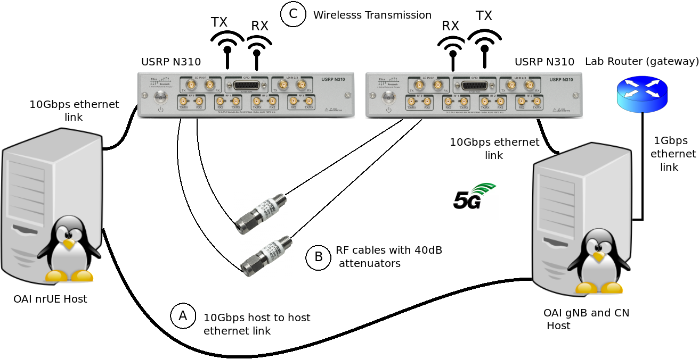
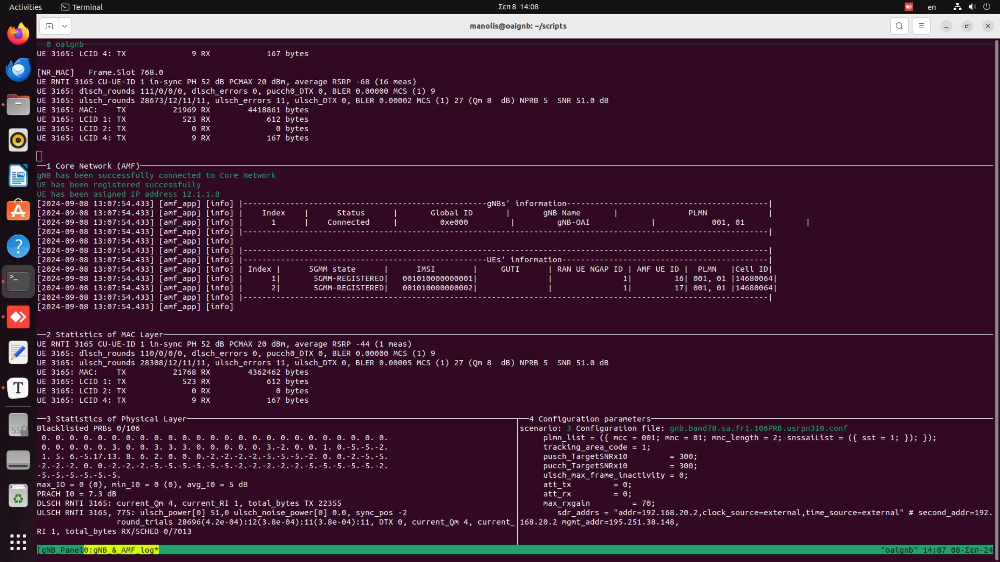

# Scripts and configuration files for Open Air Interface SA testbed with two hosts.

paper: "Enhancing 5G performance: A standalone system platform with customizable features"

https://www.sciencedirect.com/science/article/pii/S1434841124004011

## Introduction

**OAI_5G_scripts** is a set of bash scripts that run in two PCs which host the Open Air interface software and implement the gNB and UE respectively. But why to use these scripts instead of running the nr-uesoftmodem and nr-softmodem commands directly? The answer to this question is that using these scripts you can easily move the CN setup from one host to the other, run different configurations without having to execute many bash commands with different arguments each time. Furthermore, the purpose of using the scripts is to organize your tests and the respective configurations and speed up all the nesessary network checks and modifications to your setup. In this collection of scripts there are scripts to configure your PC for realtime performance, to deploy and stop the 5G core network containers, to measure the throughput and latency of the end-to-end conneciton, to startup the gNB with the specific scenario settings and to modify parameters for all or for a specific scenario.
The following picture depicts the testbed that exploits the Open Air Interface software alongside with the set of scripts in this repository.
There are basically three ways to connect UE to gNB (A-C, figure 1). The first one is to use the RFsimulator and the 10Gbps network conneciton among the two hosts. The second one is to use the SDR devices (USRP N310 in our case) to ttransmit the RF signal either by RF cables and attenuators or wirelessly using antennas. Finally the third way is to use a COTS UE to connect to the gNB. In this case best performance results can be achieved if Core NetworK containers are deployed in the UE host, and thus releasing computational resources from gNB host.


<p align="center">Figure 1</p>

There is also the **gnbpanel** script that combines the functionallity of several other scripts creating a control panel for viewing the status of gNB, Core Network and connected UE devices. The script exploites the well known tmux tool. The following figure depicts a screenshot of this script 
in action.


<p align="center">Figure 2</p>


To explore the use cases and measurements performed with this testbed you can read the paper "A Versatile 5G Standalone Testbed Based On Commodity Hardware" under the following link 

https://ieeexplore.ieee.org/document/10497086

and the extended paper titled "Enhancing 5G performance: A standalone system platform with customizable features"

https://www.sciencedirect.com/science/article/pii/S1434841124004011

A collection of videos with measurements performed with this 5G testbed can be found at:
 https://www.youtube.com/channel/UCO9M366I1N8OAOqTLJGdwLA


This branch contains the scripts and congifuration files for gNB and 5G core network host.
The files for the UE host are in the **master_ue** branch.

## Getting started

Start by installing the Open Air Interface software following the tutorial in the following link:

https://gitlab.eurecom.fr/oai/openairinterface5g/-/blob/develop/doc/NR_SA_Tutorial_OAI_nrUE.md?ref_type=heads

To pull the 2.1.0 version of OAI 5GCN containers  follow the guidelines form the following link:

https://gitlab.eurecom.fr/oai/cn5g/oai-cn5g-fed/-/blob/master/docs/RETRIEVE_OFFICIAL_IMAGES.md?ref_type=heads

**Start by editing gnb config.ini file in your gNB host and make all necessary changes to be in line with your network setup. Add to gnbconfig.ini file the correct IP assignments for the oaiue host and 5gcn host (it is the same ip as gnbhost if gnb and core network run on the same host) . You can deploy 5G core network containers in a different host. For this you need to make all necessary changes to gnbconfig.ini and then run ./gnbconfig -c to set these changes to all gNB configuration files **

Prerequisite packets are **openssh-server, iperf, speedometer, okla speedtest-cli, xclip, cpufreq-info, linux-tools-common, tmux, ethtool ** and **sensors**.

Scripts have been tested in **Ubuntu 22.04 LTS** environment. 

Use **./5gcn** to deploy core network containers, then run script **./startgnb** or **./startgnbsim** to start gNB with SDR device or RF simulator respectively. Finally run **./startue** or **./startuesim** in the UE host to connect to gNB. The **./oaitest** script is for testing the interconnection of software modules and to perform measurements of throughput and RTT values and other. 

**The default PLMN value for Core Network v1.51 and 2.1.0 is 00101 and 20295 respectively. To use different PLMN values (command argument -p in 5gcn script you need to make several changes to the OAI CN files. **

**For CN v.1.51:**

- **open file docker-compose.yml in oai-cn5g folder and change values for MCC, PLMN_SUPPORT_MCC, PLMN_SUPPORT_MNC to be in line with those of gNB configuration files. Save every different PLMN file using names like docker-compose_00101.yml,   docker-compose_50501.yml for PLMNs 00101 and 50501 respectively. Change the file oai_db.sql  found in oai-cn5g/database folder to be in line with the different UE sim settings  and save each version to the same folder again using names like oai_db_00101.sql, oai_db_50501.sql, e.t.c.** 

**For CN v.2.1.0:**

**Add the following lines in the section plmn_support_list of amf container in file oai-cn5g-fed/docker-compose/conf/basic_nrf_config.yaml**

```
    - mcc: 001
      mnc: 01
      tac: 0x0001
      nssai:
        - *embb_slice1
        - *embb_slice2
        - *custom_slice
    - mcc: 505
      mnc: 01
      tac: 0x0001
      nssai:
        - *embb_slice1
        - *embb_slice2
        - *custom_slice        
```

**Add the following lines in the section served_guami_list of amf container in file oai-cn5g-fed/docker-compose/conf/basic_nrf_config.yaml**

```
   - mcc: 505
      mnc: 01
      amf_region_id: 01
      amf_set_id: 001
      amf_pointer: 01    
```

**Change the file oai_db2.sql  found in oai-cn5g-fed/docker-compose/database folder to be in line with the different UE sim settings  and save the file with the same name**

**To start CN v1.51 with different PLMN setting you should specify it using the argument -p . For example ./5gcn -d -v 1 -p 1 for PLMN 00101. CN v2.1.0 can support multiple PLMNs so if you make the above changes to yaml and sql files you can start CN supporting all configured PLMNs without using -p argument in 5gcn script. For example ./5gcn -d -v 2**

Edit gnbconfig.ini and ueconfig.ini files to setup the appropriate values of the parameters for your network in gNb and UE host repsectively. After deploying the core network containers run **./gnbconfig -a** and **ueconfig -a** to automatically set up the rest of the network parameters. The parameters that need to be set manually are enclosed in hashtags in the gnbconfig.ini and ueconfig.ini files found in gNB and UE host respectively.
Scripts use ssh command to run commands on the other host. A good practice is to create ssh keys and use ssh-copy-id command to copy the keys in the other host, so that you do not have to type your password each time a script uses ssh.

## Changing parameters

To change the attenuation parameter for tx and rx use **./gnbconfig -t** or **./gnbconfig -r** respectively. You may find this useful for example when you want to switch from RF cables to OTA transmission. You may also want to switch between external and internal source for your SDR device using **-e** or **-i** arguments with **gnbconfig**. The configuration made with **gnbconfig** script is done in all configuration files and for all PLMN options. When you make changes to host ips or switch from core network v 1.5.1 to v 2.1.0 you need to run **gnbconfig -a** to reconfigure the ip addresses in gnbconfig.ini file and conf files in the folder configuration. 
Before running **./startgnb** or **./startgnbsim** scripts run **./hwstress** to configure CPUs and NIC interfaces for better realtime performance. Run **./hwrelax** to return back to normal settings.
Finally if you to make changes to a configuration file for a specific scenario use **./gnbconfig -s <scenario number>** script.

## Deploying core network containers on a different host

On gNB host:
If you want to run core network in a different host from gNB host, edit the variables **CN_IP** , **GNB_NIC_TO_CN** , **GNB_NIC_TO_CN_IP** and **CN_HOST_IP** in **gnbconfig.ini** file to configure a separate network interface between Core Network Host and gNB host. This connection works better at 10gbps speed. After saving changes to gnbconfig.ini file run **./gnbconfig -a** and then **./gnbconfig -c** to change the network settings of NGI interface in all configuration files.Finally run **./netsetupcn2gnb** or **./netsetupcn2ue** if you run Core Network on gNB or UE host respectively.

On Core Network Host:
Run **./5gcn -d -v <selected version> -p <selected PLMN>**
and then **./netsetupcn2gnb** or **./netsetupcn2ue** if you run Core Network on gNB or UE host respectively.
If you use a COTS UE to connect to gNB, it is better to run core network on UE host side, as you maximize the performance of gNB. 


## Creating a new scenario

There are 22 scenarios so far. To create a new scenario :
1) Insert a new element in SCENARIOS and CONFIGURATIONS tables in gnbconfig.ini file in gNB host. The SCENARIOS table contains the names of the functions implementing your scenario (the syntax of the nr-uesoftmodem command with all the parameters). CONFIGURATIONS table contains the names of the gNB configuration files for each scenario.
2) Update print_scenarios function that contains the description of each scenario in gnbconfig.ini and ueconfig.ini files found in gNB and UE host respectively.
3) write the new function that implemets your scenario and add it in startgnb, startgnbsim, startue and startuesim script files. 

## An example of running with RF Siumulator for scenario 2 with CN version 1.51

On gNB host:
-Start by entering the network conffiguration for your setup, by editing **gnbconfig.ini** file..
-run **./gnbconfig -a** to configure IPs for the two hosts
-check your setup  by running **./gnbconfig -V** to view the current configuration. 
- Start CN containers with **./5gcn -d -v 1 -p 1**
- start gNB with **./startgnbsim -s 2 -p 1**
- check connection to core network with **./oaitest -C**

On UE host:
- start UE with **./startuesim -s 2 -p 1**

On gNB host:
- check UE registration to core network with **./oaitest -c**
- create a flow of 10mbps both in DL and UL with **./oaitest -d 10m -u 10m**


## Main scripts and their functionality

The main scripts are the following (run them **without sudo** privilages, if sudo is needed script prompts for user password):

**./oaitest**

Testing tool for E2E 5G SA system using Open Air Interface with RF simulator
or 2 hosts running OAI nrUE and gNB respectively, connected to USRP N310 SDR devices.

Usage:  ./oaitest [OPTION]... [+VALUE] 

   -c, --checkue                               check UE registration status to 5G Network  

  -C, --checkngi                              check RAN connection to core network

  -p, --pdusession                         check pdu session creation in UPF and PFCP switch Packet Detection Rule list 

  -u, --uplink [value]                     create traffic to uplink. Value needs to be in bps
                                                       example for 30Mbps: -u 30M   

  -d, --downlink [value]                create traffic to downlink. Value needs to be in bps

​                                                       example for 30Mbps: -d 30M

  -t  --time [value[                         time to execute downlink and uplink tests (used with '-d' and '-u' arguments) 

​                                                       [value] is in seconds. If not defined default value is 10

  -s, --speedtest                            run speedometer tool in oaitun_ue1 interface in UE host   

​                                                       (if not already installed, install with sudo apt-get install -y speedometer)                           
  -r, --rtt                                         measure rtt executing ping commands in both uplink and downlink

  -m, --monitor [FILENAME]      starts monitoring L1, MAC and RRC producing logs and figures in figures directory.
                                                     The names of files produced contain the chosen [FILENAME] string   

  --stats [PROTOCOL]                 displays stats of selected protocol.
                                                     [PROTOCOL] can be L1, MAC or RRC          


  -h, --help                                   print this help message

  --dmax                                      get downlink maximum throughput

  --umax                                      get uplink maximum throughput 


**./startgnb**

Tool to start gnb softmodem for a particular scenario using USRP N310 SDR device
or 2 hosts running OAI nrUE and nrgNB respectively.

The ethernet link between the host and SDR needs to be at least 10Gbps 

Usage:  ./startgnb [OPTION]... [+VALUE] 

  -s, --scenario [value]   start gNB softmodem selecting scenario number [value]

   value is from the following table

                               ------------------------------------------------------------------
                              | 1 | standalone mode band 78 with 24prb  (SISO)                   |                            
                              | 2 | standalone mode band 78 with 51prb  (SISO)                   |                          
                              | 3 | standalone mode band 78 with 106prb (SISO)                   |
                              | 4 | standalone mode band 78 with 133prb (SISO)                   |                      
                              | 5 | standalone mode band 78 with 162prb (SISO)                   |      
                              | 6 | standalone mode band 78 with 217prb (SISO)                   |  
                              | 7 | standalone mode band 77 with 273prb (SISO)                   |   
                              | 8 | standalone mode band 78 with 106prb TDD 1 slot configuration |
                              |   | with 7 DL, 2 UL, 1 FL slots, Periodicity=10 Slots            |
                              | 9 | standalone mode band 78 with 106prb TDD 2 slot configuration |
                              |   | with 2 DL, 1 UL, 1 FL slots, Periodicity=4 Slots             |                     
                              | 10| standalone mode band 78 with 106prb (2x2 MIMO)               |
                              | 11| standalone mode band 78 with 133prb (2x2 MIMO)               |
                              | 12| standalone mode band 78 with 162prb (2x2 MIMO)               |     
                              | 13| standalone mode band 78 with 217prb (2x2 MIMO)               |  
                              | 14| standalone mode band 77 with 273prb (2x2 MIMO)               |
                              | 15| standalone mode band 66 with 106prb (SISO,FDD, 40MHz BWP)    |
                              | 16| standalone mode band 71 with 106prb (SISO,FDD, 20MHz BWP)    |                        
                              | 17| do-ra mode: simulated 5G NSA connection with only 5G         |
                              |   | terminals being present                                      |                                   
                              | 18| physical layer test with one slot assigned for downlink      |
                              | 19| extended phy layer test with parameters changed              |
                              |   | (parameters need to be changed directly to script code)      |  
                              | 20| standalone mode band 66 with 25 prb (SISO,FDD, 5MHz BWP)     | 
                              | 21| GEO trnasparent SAT emulation                                |
                              |   | (band 66 with 25 prb (SISO,FDD, 15KHz SCS)                   |  
                              | 22| standalone mode band 3 with 52prb (SISO,FDD, 10MHz BWP)      |                                                  
                              ------------------------------------------------------------------- 


  -p, --plmn               PLMN selection

​                           1 (default) --> 00101

​                           2           --> 50501

​                           3           --> 20295 

  -o, --scope              use nr-scope tool 

  -t, --tracer             use tracer tool to capture packets

  -l, --log                write nr-softmodem output to a log file with date and time stamp in scripts/logs folder                 

  -i, --info               show Open Air Interface version

  -h, --help               print this help message

  -c, --command_line       exit script, copy selected scenario command to a text file named COMMAND in the same folder

​                           -To view command before executing it type cat COMMAND in the command line. 

​                           -To start gNB softmodem copy and paste command to new terminal window in OAI binaries folder


**./startgnbsim**

Tool to start gnb softmodem for a particular scenario using Open Air Interface with RFsimulator
or 2 hosts running OAI nrUE and gNB respectively.
the ethernet link between the 2 hosts  needs to be at least 10Gbps 

Usage:  ./startgnbsim [OPTION]... [+VALUE] 

  -s, --scenario [value]   start gnb softmodem executing scenario number [value]
                           YOU NEED TO RUN WITH SUDO PRIVILAGES FOR "-s" OPTION
                           value is from the following table
                           

                               ------------------------------------------------------------------
                              | 1 | standalone mode band 78 with 24prb  (SISO)                   |                            
                              | 2 | standalone mode band 78 with 51prb  (SISO)                   |                          
                              | 3 | standalone mode band 78 with 106prb (SISO)                   |
                              | 4 | standalone mode band 78 with 133prb (SISO)                   |                      
                              | 5 | standalone mode band 78 with 162prb (SISO)                   |      
                              | 6 | standalone mode band 78 with 217prb (SISO)                   |  
                              | 7 | standalone mode band 77 with 273prb (SISO)                   |   
                              | 8 | standalone mode band 78 with 106prb TDD 1 slot configuration |
                              |   | with 7 DL, 2 UL, 1 FL slots, Periodicity=10 Slots            |
                              | 9 | standalone mode band 78 with 106prb TDD 2 slot configuration |
                              |   | with 2 DL, 1 UL, 1 FL slots, Periodicity=4 Slots             |                     
                              | 10| standalone mode band 78 with 106prb (2x2 MIMO)               |
                              | 11| standalone mode band 78 with 133prb (2x2 MIMO)               |
                              | 12| standalone mode band 78 with 162prb (2x2 MIMO)               |     
                              | 13| standalone mode band 78 with 217prb (2x2 MIMO)               |  
                              | 14| standalone mode band 77 with 273prb (2x2 MIMO)               |
                              | 15| standalone mode band 66 with 106prb (SISO,FDD, 40MHz BWP)    |
                              | 16| standalone mode band 71 with 106prb (SISO,FDD, 20MHz BWP)    |                        
                              | 17| do-ra mode: simulated 5G NSA connection with only 5G         |
                              |   | terminals being present                                      |                                   
                              | 18| physical layer test with one slot assigned for downlink      |
                              | 19| extended phy layer test with parameters changed              |
                              |   | (parameters need to be changed directly to script code)      |  
                              | 20| standalone mode band 66 with 25 prb (SISO,FDD, 5MHz BWP)     | 
                              | 21| GEO trnasparent SAT emulation                                |
                              |   | (band 66 with 25 prb (SISO,FDD, 15KHz SCS)                   |  
                              | 22| standalone mode band 3 with 52prb (SISO,FDD, 10MHz BWP)      |                                                              ------------------------------------------------------------------- 


  -p, --plmn               PLMN selection

​                           1 (default) --> 00101

​                           2           --> 50501

​                           3           --> 20295  

  -o, --scope              use nr-scope tool  

  -l, --log                write nr-softmodem output to a log file with date and time stamp in scripts/logs folder

  -t, --tracer             capture with T Tracer tool                        

  -i, --info               show Open Air Interface version

  -h, --help               print this help message


**./5gcn**

Tool to deploy and stop OAI Core Network containers

Usage:  ./5gcn [OPTION]... [+VALUE] 


  -d, --deploy             start 5G Core Network containers 

  -s, --stop               stop 5G Core Network containers

  -c, --clear              purge all containers that have started (in case you encounter errors starting up the containers)

  -i, --info               display version of OAI Core Network 

  -v, --version [value]    specify version of containers to deploy or stop

                           1. version 1.51
    
                           2. version 2.1.0
    
                           example: $0 -d -v 2

  -p, --plmn [value]       specify PLMN id (valid only for version 1.51) 

                           1. PLMN ---> 00101
    
                           2. PLMN ---> 50501
    
                           3. PLMN ---> 20895
    
                           example: $0 -d -v 1 -p 2                                 

  -h, --help               print this help message


**./gnbconfig**

Tool to edit configuration files for a particular scenario
using USRP N310 SDR device
or 2 hosts running OAI nrUE and nrgNB respectively.
The ethernet link between the host and SDR needs to be at least 10Gbps 

Usage:  ./gnbconfig [OPTION]... [+VALUE] 
  -s, --scenario [value]   edit gnb softmodem configuration file for a specific scenario
                           number
                           value is from the following table

                               ------------------------------------------------------------------
                              | 1 | standalone mode band 78 with 24prb  (SISO)                   |                            
                              | 2 | standalone mode band 78 with 51prb  (SISO)                   |                          
                              | 3 | standalone mode band 78 with 106prb (SISO)                   |
                              | 4 | standalone mode band 78 with 133prb (SISO)                   |                      
                              | 5 | standalone mode band 78 with 162prb (SISO)                   |      
                              | 6 | standalone mode band 78 with 217prb (SISO)                   |  
                              | 7 | standalone mode band 77 with 273prb (SISO)                   |   
                              | 8 | standalone mode band 78 with 106prb TDD 1 slot configuration |
                              |   | with 7 DL, 2 UL, 1 FL slots, Periodicity=10 Slots            |
                              | 9 | standalone mode band 78 with 106prb TDD 2 slot configuration |
                              |   | with 2 DL, 1 UL, 1 FL slots, Periodicity=4 Slots             |                     
                              | 10| standalone mode band 78 with 106prb (2x2 MIMO)               |
                              | 11| standalone mode band 78 with 133prb (2x2 MIMO)               |
                              | 12| standalone mode band 78 with 162prb (2x2 MIMO)               |     
                              | 13| standalone mode band 78 with 217prb (2x2 MIMO)               |  
                              | 14| standalone mode band 77 with 273prb (2x2 MIMO)               |
                              | 15| standalone mode band 66 with 106prb (SISO,FDD, 40MHz BWP)    |
                              | 16| standalone mode band 71 with 106prb (SISO,FDD, 20MHz BWP)    |                        
                              | 17| do-ra mode: simulated 5G NSA connection with only 5G         |
                              |   | terminals being present                                      |                                   
                              | 18| physical layer test with one slot assigned for downlink      |
                              | 19| extended phy layer test with parameters changed              |
                              |   | (parameters need to be changed directly to script code)      |  
                              | 20| standalone mode band 66 with 25 prb (SISO,FDD, 5MHz BWP)     | 
                              | 21| GEO trnasparent SAT emulation                                |
                              |   | (band 66 with 25 prb (SISO,FDD, 15KHz SCS)                   |  
                              | 22| standalone mode band 3 with 52prb (SISO,FDD, 10MHz BWP)      |                                                  
                              ------------------------------------------------------------------- 

  -a, --amf                detect host and container IPs  

  -p, --plmn                              set PLMN and TAC settings
                                                1 (default) --> 00101  TAC --> 0001
                                                2                --> 50501  TAC --> 0001 
                                                3                --> 20295  TAC --> 40960 
  --ul_max_mcs                      set max MCS in Uplink                         
  -c, --core-net                       configure network settings in gNB if Core Network is deployed in different host                         
  -e, --editor                           choose editor, combined with -s argument
                                               1 (default) --> nano
                                               2           --> gedit     
  -m, --mode                         default mode to start the gnbpanel script
                                               1 USRP N310 device
                                               2 RF simulator  
  -E,--external_source         specify SDR clock and time source as external
  -I,--internal_source           specify SDR clock and time source as internal
  -G,--gpsdo_source            specify SDR clock and time source as GPSDO  
  -t  --att_tx [value]              specify attenuation value in dB (0 - 30) for transmitter                                
                                              example: ./gnbconfig -t 10   
  -r, --att_rx [value]             specify attenuation value in dB (0 - 30) for receiver
                                              example: ./gnbconfig -r 15 
  --max_rx_gain                   specify max rx gain value in for the USRP N310 device (valid values are from 40 to 75)               
  --pusch_snr                       specify PUSCH target SNRx10 (valid values are from 100 to 500)
  --pucch_snr                       specify PUCCH target SNRx10 (valid values are from 100 to 500)
  --ulsch_inactivity              specify ul_max_frame_inactivity value (from 0 to 20. The value of 0 achieves the best latency)             
  -v, --view                            view current values of parameters in all configuration files
                                             in conjunction with '-s' display parameters only for the selected scenario
  -V  --view_ini                     view settings in gnbconfig.ini file                                                                              
  -i, --info                             show Open Air Interface software version
  -h, --help                           print this help message

**./capture**

Usage:  ./capture [OPTION]... [+VALUE]

Capture tool for E2E 5G SA system using Open Air Interface

creates pcap file to be analyzed with wireshark


  -i, --interface [value]                         select [value]=1 for loopback (deafult)

​                                                                 2 for demo-oai 


  -t, --time [value]                              capture traffic for [value] seconds (can be decimal values like 0.1 up to 480)

 -h, --help                                        print this help message
