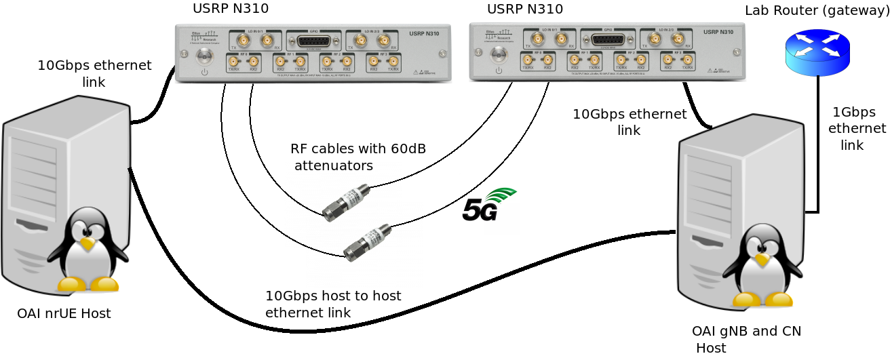

# OAI_5G_scripts


Scripts and configuration files for Open Air Interface SA testbed with two hosts.

This branch contains the files for gNB and 5G core network host.
The files for the UE host are in the **master_ue** branch.

Start by installing the Open Air Interface software following the tutorial in the following link:

https://gitlab.eurecom.fr/oai/openairinterface5g/-/blob/develop/doc/NR_SA_Tutorial_OAI_nrUE.md?ref_type=heads

To pull the 2.0.1 version of OAI 5GCN containers  follow the guidelines form the following link:

https://gitlab.eurecom.fr/oai/cn5g/oai-cn5g-fed/-/blob/master/docs/RETRIEVE_OFFICIAL_IMAGES.md?ref_type=heads

Add to your /etc/hosts file the correct IP assignments for the oaiue host and 5gcn host (it is the same ip as gnbhost if gnb and core network run on the same host) . Also make any needed changes to VARIABLES SECTION in each script to be in line with your local network setup.

Prerequisite packets are **openssh-server, iperf, speedometer, okla speedtest-cli, xclip, cpufreq-info, linux-tools-common, ethtool ** and **sensors**.

Scripts have been tested in Ubuntu 22.04 LTS environment. 

Use **./5gcn** to deploy core network containers, then run script **./startgnb** or **./startgnbsim** to start gNB with SDR device or RF simulator respectively. Finally run **./startue** or **./startuesim** in the UE host to connect to gNB. The **./oaitest** script is for testing the interconnection of software modules and to perform measurements of throughput and RTT values. 

**The default PLMN value for Core Network v1.51 and 2.0.1 is 00101 and 20295 respectively. To use different PLMN values (command argument -p in 5gcn script you need to make several changes to the OAI CN files. **

**For CN v.1.51:**

- **open file docker-compose.yml in oai-cn5g folder and change values for MCC, PLMN_SUPPORT_MCC, PLMN_SUPPORT_MNC to be in line with those of gNB configuration files. Save every different PLMN file using names like docker-compose_00101.yml,   docker-compose_50501.yml for PLMNs 00101 and 50501 respectively. Change the file oai_db.sql  found in oai-cn5g/database folder to be in line with the different UE sim settings  and save each version to the same folder again using names like oai_db_00101.sql, oai_db_50501.sql, e.t.c.** 

**For CN v.2.0.1:**

**Add the following lines in the section plmn_support_list of amf container in file oai-cn5g-fed/docker-compose/conf/basic_nrf_config.yaml**

```
    - mcc: 001
      mnc: 01
      tac: 0x0001
      nssai:
        - *embb_slice1
        - *embb_slice2
        - *custom_slice
    - mcc: 505
      mnc: 01
      tac: 0x0001
      nssai:
        - *embb_slice1
        - *embb_slice2
        - *custom_slice        
```

**Add the following lines in the section served_guami_list of amf container in file oai-cn5g-fed/docker-compose/conf/basic_nrf_config.yaml**

```
   - mcc: 505
      mnc: 01
      amf_region_id: 01
      amf_set_id: 001
      amf_pointer: 01    
```

**Change the file oai_db2.sql  found in oai-cn5g-fed/docker-compose/database folder to be in line with the different UE sim settings  and save the file with the same name**

**To start CN v1.51 with different PLMN setting you should specify it using the argument -p . For example ./5gcn -d -v 1 -p 1 for PLMN 00101. CN v2.0.1 can support multiple PLMNs so if you make the above changes to yaml and sql files you can start CN supporting all configured PLMNs without using -p argument in 5gcn script. For example ./5gcn -d -v 2**

To change the attenuation parameter for tx and rx use **./setrf -t** or **./setrf -r** respectively. You may find this useful for example when you want to switch from RF cables to OTA transmission. You may also want to switch between external and internal source for your SDR device using **-e** or **-i** arguments with **setrf**. The configuration made with **setrf** script is done in all configuration files and for both PLMN options. 

Finally if you to make changes to a configuration file for a specific scenario use **./gnbconfig** script.

**./oaitest**

Testing tool for E2E 5G SA system using Open Air Interface with RF simulator
or 2 hosts running OAI nrUE and gNB respectively, connected to USRP N310 SDR devices.

Usage:  ./oaitest [OPTION]... [+VALUE] 

   -c, --checkue                               check UE registration status to 5G Network  

  -C, --checkngi                              check RAN connection to core network

  -p, --pdusession                         check pdu session creation in UPF and PFCP switch Packet Detection Rule list 

  -u, --uplink [value]                     create traffic to uplink. Value needs to be in bps
                                                       example for 30Mbps: -u 30M   

  -d, --downlink [value]                create traffic to downlink. Value needs to be in bps

​                                                       example for 30Mbps: -d 30M

  -t  --time [value[                         time to execute downlink and uplink tests (used with '-d' and '-u' arguments) 

​                                                       [value] is in seconds. If not defined default value is 10

  -s, --speedtest                            run speedometer tool in oaitun_ue1 interface in UE host   

​                                                       (if not already installed, install with sudo apt-get install -y speedometer)                           
  -r, --rtt                                         measure rtt executing ping commands in both uplink and downlink

  -m, --monitor [FILENAME]      starts monitoring L1, MAC and RRC producing logs and figures in figures directory.
                                                     The names of files produced contain the chosen [FILENAME] string   

  --stats [PROTOCOL]                 displays stats of selected protocol.
                                                     [PROTOCOL] can be L1, MAC or RRC          


  -h, --help                                   print this help message

  --dmax                                      get downlink maximum throughput

  --umax                                      get uplink maximum throughput 


**./startgnb**

Tool to start gnb softmodem for a particular scenario using USRP N310 SDR device
or 2 hosts running OAI nrUE and nrgNB respectively.

The ethernet link between the host and SDR needs to be at least 10Gbps 

Usage:  ./startgnb [OPTION]... [+VALUE] 

  -s, --scenario [value]   start gNB softmodem selecting scenario number [value]

                           --------------------------------------------------------
                           | FOR "-s" OPTION AND WITHOUT "-c" PARAMETER SPECIFIED  |
                           | YOU MUST RUN SCRIPT WITH SUDO                         |
                           | IN ALL OTHER CASES RUN SCRIPT WITHOUT SUDO            |
                           --------------------------------------------------------


​                           value is from the following table

                               ------------------------------------------------------------------
                              | 1 | standalone mode band 78 with 51prb (SISO)                    |
                              | 2 | standalone mode band 78 with 106prb (SISO)                   |
                              | 3 | standalone mode band 78 with 106prb TDD 1 slot configuration |
                              |   | with 7 DL, 2 UL, 1 FL slots, Periodicity=10 Slots (SISO)     |
                              | 4 | standalone mode band 78 with 106prb TDD 2 slot configuration |
                              |   | with 2 DL, 1 UL, 1 FL slots, Periodicity=4 Slots  (SISO)     |
                              | 5 | standalone mode band 78 with 106prb and radio packets        |
                              |   | capture with T Tracer  (SISO)                                |
                              | 6 | standalone mode band 78 with 106prb (MIMO 2x2)               |
                              | 7 | standalone mode band 78 with 133prb (MIMO 2x2)               |
                              | 8 | standalone mode band 78 with 133prb (SISO)                   |
                              | 9 | standalone mode band 78 with 162prb (SISO)                   |
                              -------------------------------------------------------------------

  -p, --plmn                      PLMN selection

​                                         1 (default) --> 00101

​                                         2                 --> 50501

​                                         3                 --> 20295   

  -o, --scope                     use nr-scope tool              

  -l, --log                           write nr-softmodem output to a log file with date and time stamp in scripts/logs folder        


  -i, --info                          show Open Air Interface version

  -h, --help                        print this help message

  -c, --command_line      exit script, copy selected scenario command to a text file named COMMAND in the same folder
                                         -To view command before executing it type $(echo -e "${G}cat COMMAND${NOCOLOR}") in the command line. 
                                         -To start gNB softmodem copy and paste command to new terminal window in OAI binaries folder


**./startgnbsim**

Tool to start gnb softmodem for a particular scenario using Open Air Interface with RFsimulator
or 2 hosts running OAI nrUE and gNB respectively.
the ethernet link between the 2 hosts  needs to be at least 10Gbps 

Usage:  ./startgnbsim [OPTION]... [+VALUE] 

  -s, --scenario [value]   start gnb softmodem executing scenario number [value]
                           YOU NEED TO RUN WITH SUDO PRIVILAGES FOR "-s" OPTION
                           value is from the following table
                           

                           -----------------------------------------------------------------
                          | 1 | physical layer test with one slot assigned for downlink      |
                          | 2 | extended phy layer test with parameters changed              |
                          |   | (parameters need to be changed directly to script code)      |
                          | 3 | do-ra mode                                                   |
                          | 4 | standalone mode band 66                                      |
                          | 5 | standalone mode band 78 with 106prb (SISO)                   |
                          | 6 | standalone mode band 78 with 51prb  (SISO)                   |
                          | 7 | standalone mode band 77 with 273prb (2x2 MIMO)               |
                          | 8 | standalone mode band 78 with 106prb TDD 1 slot configuration |
                          |   | with 7 DL, 2 UL, 1 FL slots, Periodicity=10 Slots            |
                          | 9 | standalone mode band 78 with 106prb TDD 2 slot configuration |
                          |   | with 2 DL, 1 UL, 1 FL slots, Periodicity=4 Slots             |
                          | 10| standalone mode band 78 with 106prb and radio packets        |
                          |   | capture with T Tracer                                        |
                          | 11| standalone mode band 78 with 106prb (2x2 MIMO)               |
                          | 12| standalone mode band 78 with 133prb (2x2 MIMO)               |
                          | 13| standalone mode band 78 with 162prb (2x2 MIMO)               |     
                          | 14| standalone mode band 78 with 217prb (2x2 MIMO)               |                      
                          | 15| standalone mode band 78 with 133prb (SISO)                   |                      
                          | 16| standalone mode band 78 with 162prb (SISO)                   |      
                          | 17| standalone mode band 78 with 217prb (SISO)                   |                  
                          -------------------------------------------------------------------

  -p, --plmn               PLMN selection

​                                  1 (default)   --> 00101

​                                  2                   --> 50501

​                                  3                   --> 20295  

  -o, --scope               use nr-scope tool                              


  -i, --info                   show Open Air Interface version

  -h, --help                 print this help message


**./5gcn**

Tool to deploy and stop OAI Core Network containers

Usage:  ./5gcn [OPTION]... [+VALUE] 


  -d, --deploy                  start 5G Core Network containers 

  -s, --stop                       stop 5G Core Network containers

  -v, --version [value]    specify version of containers to deploy or stop
                                          [value]=1  version 1.51

​                                          [value]=2  version 2.0.1

​                                           example: ./5gcn  -d -v 2

  -p, --plmn [value]       specify PLMN id (valid only for version 1.51) 

​                                          [value]=1  PLMN ---> 00101

​                                          [value]=2  PLMN ---> 50501

​                                          [value]=3  PLMN ---> 20895

​                                          example: ./5gcn -d -v 1 -p 2               


  -h, --help                      print this help message


**./setrf**

tool for configuring RF parameters in Open Air Interface gNB

Usage:  ./setrf  [OPTION]... [+VALUE] 


  -e, --external_source        specify SDR clock and time source as external     


  -i, --internal_source        specify SDR clock and time source as internal       


  -t  --att_tx [value]         specify attenuation value in dB (0 - 30) for transmitter           


​                                         example: ./setrf -t 10   

  -r, --att_rx [value]         specify attenuation value in dB (0 - 30) for receiver

​                                         example: ./setrf -r 15   

  -v, --view                   view current configuration parameters           


  -h, --help                   print this help message


**./gnbconfig**

Tool to edit configuration files for a particular scenario
using USRP N310 SDR device
or 2 hosts running OAI nrUE and nrgNB respectively.
The ethernet link between the host and SDR needs to be at least 10Gbps 

Usage:  ./gnbconfig [OPTION]... [+VALUE] 
  -s, --scenario [value]   edit gnb softmodem configuration file for a specific scenario
                           number
                           value is from the following table

                           ------------------------------------------------------------------
                          | 1 | standalone mode band 78 with 51prb (SISO)                    |
                          | 2 | standalone mode band 78 with 106prb (SISO)                   |
                          | 3 | standalone mode band 78 with 106prb TDD 1 slot configuration |
                          |   | with 7 DL, 2 UL, 1 FL slots, Periodicity=10 Slots (SISO)     |
                          | 4 | standalone mode band 78 with 106prb TDD 2 slot configuration |
                          |   | with 2 DL, 1 UL, 1 FL slots, Periodicity=4 Slots  (SISO)     |
                          | 5 | standalone mode band 78 with 106prb and radio packets        |
                          |   | capture with T Tracer  (SISO)                                |
                          | 6 | standalone mode band 78 with 106prb (MIMO 2x2)               |
                          | 7 | standalone mode band 78 with 133prb (MIMO 2x2)               |
                          | 8 | standalone mode band 78 with 133prb (SISO)                   |
                          | 9 | standalone mode band 78 with 162prb (SISO)                   |
                          -------------------------------------------------------------------

  -p, --plmn              set PLMN and TAC settings

​                                       1 (default) --> 00101  TAC --> 0001

​                                       2           --> 50501  TAC --> 0001 

​                                       3           --> 20295  TAC --> 40960 

  -e, --editor             choose editor, combined with -s argument

​                                       1 (default) --> nano

​                                       2           --> gedit                               


  -i, --info                  show Open Air Interface software version

  -h, --help                print this help message


